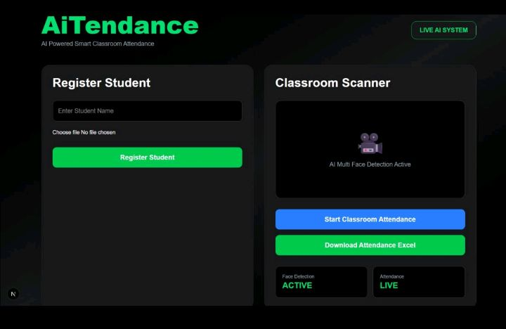
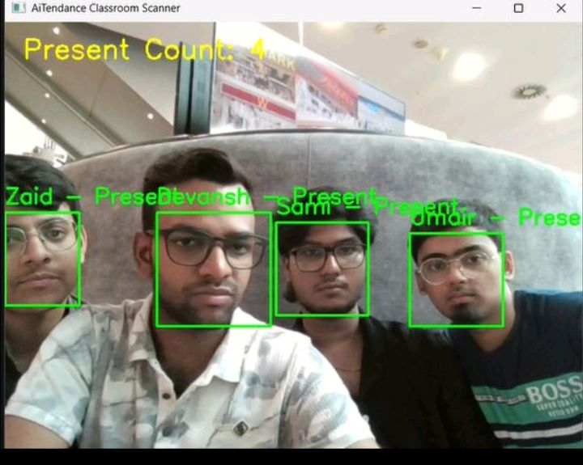
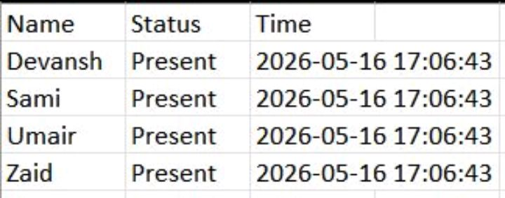

## AI Attendance System

An AI-powered attendance management system using facial recognition technology to automate attendance tracking.

## Features
- Face recognition attendance
- Automated report generation
- Student image upload
- Attendance history tracking

## Technologies Used
- Python
- OpenCV
- Next.js
- TypeScript

## Project Structure
- frontend/
- backend/

## Future Enhancements
- Live webcam attendance
- Dashboard analytics
- Cloud deployment

  
## Screenshots

### Home Dashboard

### Live Face Scanning

### Attendance Report in Excel

